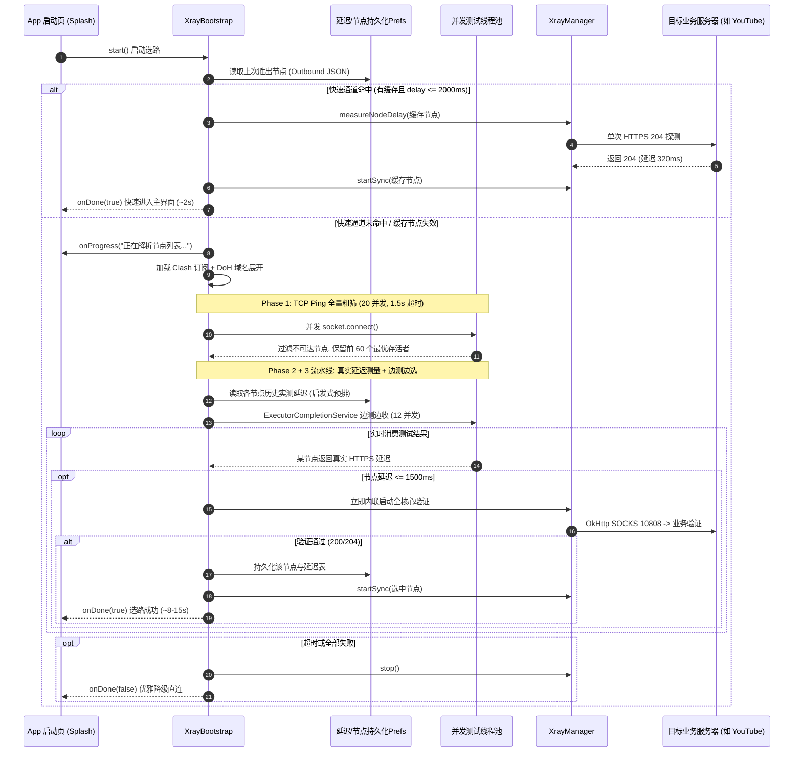

# 通用 Android 应用内置 Java 版 Xray 代理改造：方法论与标准化提示词

> **版本**：v2.0 (生产级完整版)  
> **参考实现**：SmartTube `xray-proxy` 分支（基于纯 Java 重构版 `v2ray-java` 核心）  
> **核心源码参考**：  
> - `common/.../proxy/xray/`（`XrayBootstrap`, `XrayManager`, `XrayNodeSelector`, `ClashConfigParser`, `DohResolver`, `ProxyNode`）  
> - `common/.../proxy/ProxyManager.java`（JVM 代理注入与 WebView 反射通知）  
> - `common/.../app/presenters/SplashPresenter.java`（启动门控与看门狗机制）  
> - `docs/plans/2026-09-05-v2ray-java-interop-bugs.md`（协议互通性踩坑实录）  

---

## 目录
1. [总体设计哲学与技术选型](#一总体设计哲学与技术选型)
2. [五层工程化改造方法论](#二五层工程化改造方法论)
   - [Layer 0：核心库引入与构建配置](#layer-0核心库引入与构建配置)
   - [Layer 1：双实例生命周期管理器 (XrayManager)](#layer-1双实例生命周期管理器-xraymanager)
   - [Layer 2：订阅源体系与 DoH 抗污染展开 (Clash & DoH)](#layer-2订阅源体系与-doh-抗污染展开-clash--doh)
   - [Layer 3：冷启动流水线自动选路 (XrayBootstrap)](#layer-3冷启动流水线自动选路-xraybootstrap)
   - [Layer 4：全应用流量接管与网络栈盲区治理](#layer-4全应用流量接管与网络栈盲区治理)
   - [Layer 5：启动门控、看门狗与优雅降级](#layer-5启动门控看门狗与优雅降级)
3. [生产级避坑指南 (踩坑实录)](#三生产级避坑指南-踩坑实录)
4. [工程实施 Checklist 与工作量评估](#四工程实施-checklist-与工作量评估)
5. [通用改造标准化 AI 提示词 (Prompt Template)](#五通用改造标准化-ai-提示词-prompt-template)

---

## 一、总体设计哲学与技术选型

在 Android 应用内实现开箱即用、无需系统 VPN 授权的透明代理能力，SmartTube 的演进提供了极具价值的工程实践。本方案的核心架构如下：

```
┌──────────────────────────────── 目标 Android App 进程 ────────────────────────────────┐
│                                                                                       │
│  业务网络层 (OkHttp / Retrofit / HttpURLConnection / WebView / ExoPlayer OkHttpSource)│
│                                      │                                                │
│                                      ▼ 遵从 JVM socksProxyHost/socksProxyPort          │
│                              127.0.0.1:10808 (本地环回)                                │
│                                      │                                                │
│  ┌───────────────────────────────────▼──────────────────────────────────────────────┐  │
│  │                     内嵌 v2ray-java 核心 (纯 Java / Netty)                       │  │
│  │   · 本地 SOCKS5 Inbound (无鉴权, 支持 UDP)                                       │  │
│  │   · Outbound 转换路由 (VMess / VLESS / Shadowsocks / Trojan)                     │  │
│  │   · Freedom 出站兜底                                                             │  │
│  └───────────────────────────────────┬──────────────────────────────────────────────┘  │
│                                      │                                                │
└──────────────────────────────────────┼────────────────────────────────────────────────┘
                                       │ 目标加密传输协议 (TLS / Reality / WS / gRPC)
                                       ▼
                         选中的最优代理节点 (Proxy Node)
                                       │
                                       ▼
                   目标受限服务 (如 YouTube / Google / 业务海外 API)
```

### 三大核心决策及其工程依据

| 决策维度 | 选型方案 | 替代方案 (放弃) | 决策依据与工程收益 |
|---|---|---|---|
| **核心实现** | **纯 Java 核心 (`v2ray-java`)** | Go gomobile AAR (`libv2ray.aar`) / C++ 原生 | **1. 极小体积**：省去 armeabi-v7a/arm64-v8a/x86/x86_64 四套 `.so`，包体积缩减 30~60MB；<br>**2. 零 JNI 崩溃**：杜绝因底包内存越界、信号未捕获导致的难以定位的 native SIGSEGV 闪退；<br>**3. 无 ABI 约束**：消除 32/64 位混编兼容性障碍，完全贴合现代 64-bit Google Play 规范；<br>**4. 调试直观**：Netty 管道与 Java 线程堆栈完全透明。 |
| **流量分流** | **本地 SOCKS5 入站 + JVM 系统属性 + WebView 反射** | Android `VpnService` 虚拟网卡 | **1. 零权限弹窗**：无需弹出系统级“代理/VPN授权”弹窗，用户完全无感；<br>**2. 不占 VPN 槽位**：不独占 Android 系统唯一的 VPN 接口，不干扰设备上的其他网络工具；<br>**3. 仅作用于本进程**：零全局网络污染，不需要处理复杂的 `tun2socks` 驱动与 IP 路由表。 |
| **节点选路** | **冷启动自适应流水线 (快速通道 2s + 启发式 3 阶段)** | 静态硬编码节点 / 用户手动选择 | **1. 全自动化**：用户打开即用，无需理解任何节点概念；<br>**2. 快速通道极致体验**：命中有效缓存时仅 2s 进入界面；<br>**3. 强容错**：远程订阅轮换 + assets 兜底 + 优雅降级直连，保证节点腐烂时不挂死应用。 |

---

## 二、五层工程化改造方法论

### Layer 0：核心库引入与构建配置

#### 1. 依赖体系
纯 Java Xray 核心基于 Netty 异步网络引擎、BouncyCastle 加密套件以及 Jackson JSON 解析器。
- **推荐形式**：构建已完成 Shading 的 Fat Jar（剥离无用包，重定向冲突的包名），放入项目的 `libs/v2ray-java.jar`。
- **拆分引入形式**（`build.gradle`）：
```groovy
dependencies {
    implementation files('libs/v2ray-java.jar') // 或通过私有 Maven 引入
    // 若非 Fat Jar，需补充底层支撑：
    implementation 'io.netty:netty-all:4.1.100.Final'
    implementation 'org.bouncycastle:bcprov-jdk18on:1.77'
    implementation 'com.fasterxml.jackson.core:jackson-databind:2.15.2'
    implementation 'org.yaml:snakeyaml:2.2' // 用于解析 Clash 订阅 YAML
}
```

#### 2. 编译与 D8 Desugaring
v2ray-java 采用 Java 8/11 语法特性（`CompletableFuture`, `Stream API`, `try-with-resources`），在 `app/build.gradle` 中必须开启完整 desugaring：
```groovy
android {
    compileOptions {
        sourceCompatibility JavaVersion.VERSION_1_8
        targetCompatibility JavaVersion.VERSION_1_8
        coreLibraryDesugaringEnabled true
    }
}
dependencies {
    coreLibraryDesugaring 'com.android.tools:desugar_jdk_libs:2.0.4'
}
```

#### 3. R8 / ProGuard 混淆规则
Netty 包含大量动态反射加载（如 Unsafe、Transport 反射）、BouncyCastle JCE 安全提供者、Jackson 字段序列化，发布 Release 包时必须严格保留：
```proguard
# v2ray-java 核心
-keep class com.v2ray.** { *; }

# Netty 网络库（反射机制与 Unsafe 内存）
-keep class io.netty.** { *; }
-dontwarn io.netty.**

# BouncyCastle 加密提供者
-keep class org.bouncycastle.** { *; }
-dontwarn org.bouncycastle.**

# Jackson 序列化与数据模型
-keepattributes Signature, *Annotation*, InnerClasses, EnclosingMethod
-keepclassmembers class * {
    @com.fasterxml.jackson.annotation.* *;
}
-keep class com.fasterxml.jackson.** { *; }
```

---

### Layer 1：双实例生命周期管理器 (XrayManager)

`XrayManager` 是核心的运行时控制器。它必须解决一个关键工程问题：**主服务运行与测速实例隔离**。

#### 1. 单例与双实例架构设计
- **主实例 (Main Instance)**：固定监听 `127.0.0.1:10808`，负责为整个 App 转发所有业务流量。
- **测速临时实例 (Measure Instances)**：在独立动态端口段（如 `23200 ~ 24200`）动态启动临时轻量核心，仅挂载单一待测 outbound，完成单次测速后立即销毁关闭。这使得多节点并发测速完全独立，绝不污染或打断主业务通道。

#### 2. 核心架构代码范式
```java
public class XrayManager {
    public static final String LOCAL_HOST = "127.0.0.1";
    public static final int LOCAL_PORT = 10808;
    private static final int MEASURE_PORT_BASE = 23200;
    private static final int MEASURE_PORT_RANGE = 1000;
    private static final AtomicInteger sMeasurePort = new AtomicInteger(MEASURE_PORT_BASE);

    private static XrayManager sInstance;
    private V2RayInstance mInstance;

    public static synchronized XrayManager instance(Context context) {
        if (sInstance == null) sInstance = new XrayManager(context);
        return sInstance;
    }

    /** 启动主代理核心并严格等待端口就绪 */
    public synchronized void startSync(String outboundJson) throws Exception {
        if (isRunning()) return;
        V2RayConfig config = ConfigLoader.load(buildConfig(outboundJson));
        V2RayInstance instance = ConfigLoader.createInstance(config);
        instance.start();
        mInstance = instance;
        // 关键点：Netty 异步 bind，start() 返回并不代表 socket 已可 accept，必须探测就绪
        waitForPort(LOCAL_PORT, 10_000);
    }

    public synchronized void stop() {
        if (mInstance != null) {
            try { mInstance.close(); } catch (Exception ignored) {}
            mInstance = null;
        }
    }

    /** 独立临时实例测速：计时单次针对真实业务 URL 的握手延迟 */
    public static long measureNodeDelay(ProxyNode node, String verifyUrl) {
        int port = nextMeasurePort();
        V2RayInstance instance = null;
        try {
            V2RayConfig config = ConfigLoader.load(buildMeasureConfig(node.getOutbound(), port));
            instance = ConfigLoader.createInstance(config);
            instance.start();
            waitForPort(port, 5_000);

            OkHttpClient client = new OkHttpClient.Builder()
                    .proxy(new Proxy(Proxy.Type.SOCKS, new InetSocketAddress(LOCAL_HOST, port)))
                    .connectTimeout(8_000, TimeUnit.MILLISECONDS)
                    .readTimeout(8_000, TimeUnit.MILLISECONDS)
                    .build();

            long start = System.currentTimeMillis();
            try (Response response = client.newCall(new Request.Builder().url(verifyUrl).build()).execute()) {
                if (response.code() == 204 || response.code() == 200) {
                    return System.currentTimeMillis() - start;
                }
            }
            return -1;
        } catch (Exception e) {
            return -1;
        } finally {
            if (instance != null) {
                try { instance.close(); } catch (Exception ignored) {}
            }
        }
    }

    private static int nextMeasurePort() {
        return sMeasurePort.updateAndGet(p -> p >= MEASURE_PORT_BASE + MEASURE_PORT_RANGE ? MEASURE_PORT_BASE : p + 1);
    }

    private static void waitForPort(int port, long timeoutMs) throws IOException {
        long deadline = System.currentTimeMillis() + timeoutMs;
        while (System.currentTimeMillis() < deadline) {
            try (Socket socket = new Socket()) {
                socket.connect(new InetSocketAddress(LOCAL_HOST, port), 500);
                return; // 连接成功说明 SOCKS 服务已完全就绪
            } catch (IOException ignored) {
                try { Thread.sleep(150); } catch (InterruptedException e) { break; }
            }
        }
        throw new IOException("Port " + port + " did not open in " + timeoutMs + "ms");
    }
}
```

---

### Layer 2：订阅源体系与 DoH 抗污染展开 (Clash & DoH)

#### 1. 三级节点源回退 (Remote-First 模式)
静态打包在 APK assets 内的节点列表往往会在 1~2 个月内因机场证书更新、IP 封锁而失效（节点“腐烂”）。因此必须遵循**远程订阅优先**策略：
1. **用户自定义 URL**：高级用户在设置中填入的个人订阅链接；
2. **应用内置远程订阅 URL**：由应用维护方托管的动态更新订阅接口（拉取时使用 `Proxy.NO_PROXY` 直连，避免与代理自锁）；
3. **Assets 本地 YAML 兜底**：`assets/clash_fallback.yaml`，仅在彻底断网或首次无法获取远程订阅时保底。

#### 2. Clash YAML 到 Xray Outbound 转换
通过 SnakeYAML 读取 `proxies` 节点，将主流协议属性转化为 Xray 标准 JSON：
- **VMess**：映射 `vnext.users[uuid, alterId, security]`。
- **VLESS**：映射 `vnext.users[uuid, encryption=none, flow]`。
- **Shadowsocks / Trojan**：映射 `servers[address, port, password, method]`。
- **StreamSettings**：
  - `ws-opts` 映射为 `wsSettings.path` 与 `headers`；
  - `grpc-opts` 映射为 `grpcSettings.serviceName`；
  - `reality-opts` 映射为 `security: "reality"`, `publicKey`, `shortId`, `fingerprint`；
  - `tls` 映射为 `security: "tls"`。
  - **重要警示**：现代 Xray-core 已彻底移除 `allowInsecure` 字段，生成的 outbound JSON 中切勿携带该字段，否则核心启动将抛出 Schema 校验异常。

#### 3. 域名节点的 DoH 动态健康展开 (DohResolver)
- **背景痛点**：大量机场订阅采用泛解析域名。在受限网络环境下，系统 Local DNS 解析域名会被严重污染（返回假 IP 或超时）。
- **解法**：
  1. 从 Clash 配置的 `dns.proxy-server-nameserver` 提取 DoH 权威解析端点（如 `https://<ip>:<port>/dns-query`）；
  2. 使用 RFC 8484（GET `?dns=<base64url>`）直接对 DoH 节点发起查询；
  3. 由于端点常为直接 IP + 自签证书，必须在请求中使用 TrustAll SSLContext；
  4. 将 1 个域名节点解析出的多个真实 IP，动态扩展为 N 个带有固定 IP 的 `ProxyNode` 候选变体；
  5. 后续交由 Phase 1 TCP Ping 并发修剪，仅保留延迟最低的那个 IP 变体，彻底化解 DNS 污染。

---

### Layer 3：冷启动流水线自动选路 (XrayBootstrap)

自动选路的核心在于：**在保证准确性的前提下，将冷启动耗时从数十秒压缩到极限。**

#### 选路状态机时序图



#### 关键阶段与参数校准
1. **快速通道 (Fast Path)**：
   - 读取上一次成功保存的 `outboundJson`；
   - 临时实例实测目标业务 URL：若 `0 < delayMs <= 2000ms`，直接启动主核心；
   - 耗时通常在 **1.5s ~ 2.2s**。
2. **Phase 1 全量粗筛 (TCP Ping)**：
   - 20 并发线程池，`Socket.connect` 超时 1500ms；
   - 剔除完全断连的死节点，对 DoH 展开的同名 IP 变体去重（保留 TCP RTT 最短的 IP）；
   - 截取 Top 60 进入精排。
3. **Phase 2 业务实测 (Real Measure) + 启发式优先**：
   - **历史延迟优先**：利用上次运行持久化的节点延迟表对这 60 个节点进行排序，将历史上质量优秀的节点排在队列前面优先执行；
   - 12 并发线程池，配合 `ExecutorCompletionService` 实现**边完成边消费**，拒绝“等木桶最短那块板”；
   - **早退机制 (Early Exit)**：只要累计发现 3 个节点的实测延迟低于 1500ms，立即终止剩余节点的测速，防止长时间等待长尾；整体设置 60s 硬超时兜底。
4. **Phase 3 流水线化全核心验证 (Pipeline Full Core Check)**：
   - 在 Phase 2 测速过程中，一旦某个节点实测通过，立即内联在主核心上验证（`https://www.youtube.com/generate_204`）；
   - 一旦验证成功，立即退出选路并宣布获胜；若流水线未中，最多兜底测试 Phase 2 排序后的前 3 个候选节点。

---

### Layer 4：全应用流量接管与网络栈盲区治理

#### 1. JVM 系统属性动态注入
在选中节点后，配置系统内存级代理属性：
```java
System.setProperty("socksProxyHost", "127.0.0.1");
System.setProperty("socksProxyPort", "10808");
// 必须彻底清理 HTTP/HTTPS 属性，防止 OkHttp 发生双重代理冲突
System.clearProperty("http.proxyHost");
System.clearProperty("http.proxyPort");
System.clearProperty("https.proxyHost");
System.clearProperty("https.proxyPort");
```

#### 2. OkHttp 共享连接池驱逐（避免直连残留）
如果应用在 Xray 启动完成前已经发起过网络请求（例如某些第三方 SDK 初始化），OkHttpClient 的静态连接池内可能已缓存了直连 Socket。代理切换后，必须主动驱逐旧连接：
```java
// 如果项目中有全局 OkHttpClient 单例
public static void refreshProxy() {
    if (sGlobalOkHttpClient != null) {
        sGlobalOkHttpClient.connectionPool().evictAll();
    }
}
```

#### 3. 绕过 JVM 属性的网络栈治理（关键盲区排查）
并非所有 Android 网络请求都遵守 `socksProxyHost`，必须逐一排查治理：
- **Cronet / Chromium 网络栈**：Chromet 默认直接调用底层 C++ Socket，完全绕过 JVM 系统属性。  
  *治理方案*：在音视频播放器（如 ExoPlayer）中，将 `CronetDataSource` 强制替换为 `OkHttpDataSource`。
- **Android WebView 代理同步**：WebView 运行在独立渲染/网络机制中。  
  *治理方案*：通过反射 Android 隐藏 API `LoadedApk.mReceivers`，通知 Chromium 的 `ProxyChangeListener` 接收广播：
  ```java
  Field loadedApkField = context.getApplicationContext().getClass().getField("mLoadedApk");
  loadedApkField.setAccessible(true);
  Object loadedApk = loadedApkField.get(context.getApplicationContext());
  Class<?> loadedApkCls = Class.forName("android.app.LoadedApk");
  Field receiversField = loadedApkCls.getDeclaredField("mReceivers");
  receiversField.setAccessible(true);
  ArrayMap receivers = (ArrayMap) receiversField.get(loadedApk);
  for (Object receiverMap : receivers.values()) {
      for (Object rec : ((ArrayMap) receiverMap).keySet()) {
          if (rec.getClass().getName().contains("ProxyChangeListener")) {
              Method onReceiveMethod = rec.getClass().getDeclaredMethod("onReceive", Context.class, Intent.class);
              Intent intent = new Intent(android.net.Proxy.PROXY_CHANGE_ACTION);
              intent.putExtra("android.intent.extra.PROXY_INFO", ProxyInfo.buildDirectProxy("127.0.0.1", 10808));
              onReceiveMethod.invoke(rec, context.getApplicationContext(), intent);
          }
      }
  }
  ```

---

### Layer 5：启动门控、看门狗与优雅降级

#### 1. Splash 启动门控流程
在主 `Activity` 或 `SplashPresenter` 中挂起正常业务渲染，直到 XrayBootstrap 给出结果：
```java
mBootstrapPending = true;
// 启动 60s 看门狗，防止任何异常导致应用卡死在 Splash 界面
mHandler.postDelayed(mWatchdogRunnable, 60_000);

XrayBootstrap.start(context, new XrayBootstrap.Callback() {
    @Override
    public void onProgress(String message) {
        // 更新启动页文案，如：“正在优选网络节点 (35/120)...”
        splashView.updateProgress(message);
    }

    @Override
    public void onDone(boolean proxyActive) {
        mHandler.removeCallbacks(mWatchdogRunnable);
        mBootstrapPending = false;
        if (!proxyActive) {
            // 选路失败：显示友好 Toast，停留 1.5s 后直连进入
            splashView.showToast("网络节点暂不可用，已切换为直连模式");
            mHandler.postDelayed(() -> enterMainActivity(), 1500);
        } else {
            enterMainActivity();
        }
    }
});
```

#### 2. 优雅降级与全链路自愈
- **全失败保护**：当全部节点无法连接或用户处于完全断网状态时，`XrayBootstrap` 必须：
  1. 调用 `XrayManager.stop()` 销毁核心；
  2. 清除 `socksProxyHost` / `socksProxyPort` JVM 属性；
  3. 回退为标准 DIRECT 直连；
  4. 绝不阻断用户进入应用界面（即使离线缓存内容也应能查看）。

---

## 三、生产级避坑指南 (踩坑实录)

以下问题均为真实设备实测驱动暴露的隐蔽 Bug，在改造时必须作为严格规范执行：

| 陷阱编号 | 现象与错误描述 | 根因剖析 | 正确对策与代码规范 |
|:---:|---|---|---|
| **坑 1** | **VMess/VLESS 节点全部超时**<br>明明节点可用，但在某些 TV 盒子/车载机上全军覆没 | VMess 协议严格依赖时间戳认证（时间窗通常要求在 **±90~120 秒** 以内）。部分安卓设备关机断电后 RTC 重置，系统时间错误。 | 1. 引导用户开启网络自动同步时间；<br>2. 核心或客户端内置简易 NTP 校准机制。 |
| **坑 2** | **分块长度少算 16 字节 GCM tag**<br>VMess AES-128-GCM 握手解码对端直接报 Bad Decrypt | Go 原版 Xray-core 的 `encryptedSize + paddingSize` 计算中隐式包含了 16 字节 GCM Auth Tag。部分 Java 重写实现漏加了这 16 字节。 | 对照 Xray-core `common/crypto/auth.go` 源码，校验数据帧长度计算逻辑。 |
| **坑 3** | **PendingBufferHandler 未摘除吞数据**<br>TCP 连接握手成功，后续发送 HTTP Request 数据被核心吞掉 | Netty 管道里的缓存处理器在执行完 flush 初始握手数据后，未从 `ChannelPipeline` 中自我 `remove()`，导致后续业务包持续被其拦截。 | 在 Flush 完成的回调中，显式调用 `pipeline.remove(this)`。 |
| **坑 4** | **惰性写响应头导致的双向死锁**<br>客户端连上后卡死在握手阶段，无响应直到超时 | Xray Go 服务端采用缓冲写入器（惰性写响应头，待首批下行业务数据到达时才一并 flush）；若 Java 客户端死等响应头才发送首包，双向永久死锁。 | 客户端在建立底层连接后立即将客户端首批数据发出，响应头采用异步流水线校验。 |
| **坑 5** | **SOCKS5 握手 Android libcore 格式不兼容**<br>`Unable to parse TLS packet header`，OkHttp 报错 | SOCKS5 成功握手时，若按 RFC 回显域名型地址，Android libcore `SocksSocketImpl` 存在按 IPv4 定长读取的 Bug，残存字节被后续 Conscrypt 误认为 TLS 记录。 | SOCKS5 Inbound 服务端的 Success 响应体地址字段固定回显 `0.0.0.0:0`（与 Xray-core Go 行为一致）。 |
| **坑 6** | **Netty 异步 bind 导致假启动**<br>`start()` 返回后发请求提示 `Connection refused` | Netty 的 `bind()` 返回的是 `ChannelFuture`，其完成是异步的。 | 在启动后必须执行 `waitForPort(10808)`，直到真正完成本地 TCP 握手才允许释放。 |
| **坑 7** | **Clash 节点携带 `allowInsecure` 报错**<br>Xray-core 抛出 JSON parse error | 新版 Xray-core 已废弃并移除了 `allowInsecure` 属性，只要包含该 key 就会抛出配置解析失败。 | 在 `ClashConfigParser` 构建 outbound JSON 时，禁止输出 `allowInsecure` 字段。 |

---

## 四、工程实施 Checklist 与工作量评估

### 移植工作量参考
| 模块名称 | 代码量参考 | 移植复杂度 | 适配注意点 |
|---|---|---|---|
| `XrayManager` | ~240 行 | **极低 (可直接复用)** | 仅需指定本地端口与临时测速端口范围 |
| `ClashConfigParser` | ~250 行 | **极低 (通用解析器)** | 依赖 snakeyaml，转换 vmess/vless/ss/trojan |
| `DohResolver` | ~300 行 | **低 (通用模块)** | 仅在有域名订阅且需抗 DNS 污染时接入 |
| `XrayBootstrap` | ~480 行 | **中等** | 替换目标业务 `VERIFY_URL` 与延迟参数 |
| **应用网络层适配** | 因工程而异 | **主要工作量 (40%~60%)** | 排查 Cronet、WebView、第三方 SDK、OkHttp 连接池 |
| **Splash 启动门控** | ~100 行 | **低** | 绑定现有 App 的启动流程与看门狗 |

### 验收测试用例 (Acceptance Tests)
- [ ] **冷启动初次选路**：清除应用数据后冷启动，启动页显示选路进度文案，10~20s 内选出最优节点进入主页。
- [ ] **冷启动快速通道**：杀进程二次启动，快速通道命中，主页面在 **2s 内** 无感进入。
- [ ] **全断网容错**：开启飞行模式冷启动，看门狗超时后不发生 ANR，给出提示并以直连进入主界面。
- [ ] **Release 混淆构建**：打包签名 Release APK，确保 R8 混淆后 Netty 反射与加解密运行正常，不出现 `ClassNotFoundException`。
- [ ] **混合网络栈打通**：验证主接口（Retrofit/OkHttp）、图片加载（Glide/Coil）、网页展示（WebView）均能成功透过代理加载海外资源。

---

## 五、通用改造标准化 AI 提示词 (Prompt Template)

> **使用说明**：本提示词经过高度结构化与防御性设计，适用于 Claude 3.7 / Antigravity / GPT-4o 等 AI 编程助手。只需将下方的占位符替换为你目标项目的实际参数，即可投喂给 AI 自动完成全套集成。

```markdown
# 任务指令：为当前 Android 应用集成纯 Java 版 Xray 核心并实现启动自适应全自动选路

## 一、改造背景与核心目标
请为本 Android 目标项目嵌入纯 Java 版 Xray 核心（v2ray-java），实现应用内的全自动代理与流量分流：
1. **纯 Java 实现**：不使用任何 Go gomobile AAR 或 JNI C++ 原生库，规避 ABI 限制并缩减 APK 体积。
2. **免 VpnService**：在本地 127.0.0.1:10808 建立轻量级 SOCKS5 入站，通过配置 JVM 系统属性（socksProxyHost）实现全 App 透明代理，不弹出系统 VPN 授权弹窗，不影响其他外部应用。
3. **冷启动自适应选路**：冷启动时结合“快速通道”与“三阶段启发式流水线”从 Clash 订阅中自动探测并启动最优节点，全程无需用户干预；选路失败时优雅降级为直连，不影响应用正常进入。

## 二、目标项目参数（请根据实际项目替换）
- 目标包名路径：{{TARGET_PACKAGE，例如 com.example.app.proxy.xray}}
- 目标业务验证 URL：{{VERIFY_URL，例如 https://www.google.com/generate_204 或应用核心 API}}
- 默认远程订阅 URL（Clash YAML 格式）：{{DEFAULT_SUBSCRIPTION_URL}}
- 本地兜底 Assets 配置文件：{{ASSET_CLASH_PATH，例如 assets/default_clash.yaml}}
- 应用主网络栈与启动类：{{MAIN_HTTP_CLIENT，例如 OkHttpManager / Retrofit}}，启动类：{{SPLASH_ACTIVITY}}

---

## 三、分步实施要求

### 1. 依赖与 ProGuard 配置
- 在对应模块的 `build.gradle` 引入 `v2ray-java` 核心 Jar 包（若非 Fat Jar，引入 netty-all 4.1.x, bouncycastle bcprov-jdk18on, jackson-databind, snakeyaml）；确保启用 `coreLibraryDesugaring`。
- 配置 ProGuard/R8 保留规则：
  - 保留 `com.v2ray.**` 全类与成员；
  - 保留 `io.netty.**` 全类，避开 Netty 的反射混淆；
  - 保留 `org.bouncycastle.**` JCE 提供者；
  - 保留 Jackson 序列化注解与 POJO 成员。

### 2. 核心控制器 (XrayManager)
在 `{{TARGET_PACKAGE}}` 下实现单例 `XrayManager`：
- `startSync(outboundJson)`：组装「本地 SOCKS5 Inbound (127.0.0.1:10808, 无鉴权, udp=true) + 指定 Outbound + Direct 兜底」配置；调用核心启动并必须调用 `waitForPort(10808)` 探测本地端口真正就绪后才返回。
- `stop()`：优雅安全地关闭运行中的 `V2RayInstance`。
- `measureNodeDelay(ProxyNode node, String verifyUrl)`：在动态端口段（23200~24200 循环）启动临时独立的 `V2RayInstance`，通过其私有 SOCKS 端口发起单次 HTTP GET 请求到 `{{VERIFY_URL}}`（期望状态码 200 或 204），计时 RTT 并返回（失败返回 -1）；确保 `finally` 块中立即关闭临时实例。

### 3. 订阅解析与 DoH 扩展引擎
在 `{{TARGET_PACKAGE}}` 下实现：
- `ProxyNode`：节点实体类，保存 name, server, port, type, delayMs 以及转换后的 Xray outbound `JSONObject`。
- `ClashConfigParser`：使用 SnakeYAML 解析 Clash 格式中的 `proxies` 列表；将 `vmess`, `vless`, `ss`, `trojan` 转为 Xray Outbound JSON 结构（包括 ws-opts, grpc-opts, tls, reality-opts 的完整映射）；注意严禁输出废弃的 `allowInsecure` 字段。
- `DohResolver`：若节点 server 为域名，解析 Clash 中的 `dns.proxy-server-nameserver` DoH 地址，通过 RFC 8484（TrustAll SSL）查询真实可用 IP，将一个域名节点展开为多个 IP 候选变体。

### 4. 冷启动选路流水线 (XrayBootstrap)
在 `{{TARGET_PACKAGE}}` 下实现 `XrayBootstrap` 静态启动流水线：
- **快速通道 (Fast Path)**：
  - 读取持久化保存的上次优胜节点 Outbound JSON；
  - 若存在，直接调用 `measureNodeDelay` 测速；若 `0 < delay <= 2000ms`，直接启动主核心并绑定 10808，快速结束返回（全过程控制在 2s 左右）。
- **完整流水线选路 (三阶段)**：
  - 订阅加载回退：用户设置 URL -> 默认远程 URL -> Assets 本地 YAML；
  - **Phase 1**：TCP Ping 粗筛（20 线程并发，1.5s 超时），剔除死节点，按 RTT 排序并按节点名去重；取 Top 60；
  - **Phase 2**：真实延迟测速。读取持久化历史延迟表进行预排序；使用 `ExecutorCompletionService`（12 线程）边出结果边处理；
  - **早退机制与 Phase 3 流水线化**：只要发现 3 个节点实测延时低于 1500ms 立即退出 Phase 2；在遍历中对达标节点立即挂载主核心验证 `{{VERIFY_URL}}`，验证通过直接确认获胜，返回主线程。
- **持久化**：选路成功后保存最优节点名、Outbound JSON 以及各节点最新延迟表。

### 5. 应用网络层集成与盲区治理
- **JVM 代理注入**：选路成功后执行：
  `System.setProperty("socksProxyHost", "127.0.0.1")` 与 `socksProxyPort=10808`；同时清理 `http.proxyHost/Port`。
- **连接池清理**：对项目中的 `OkHttpClient` 执行连接池驱逐（`connectionPool.evictAll()`）或通知重建。
- **WebView 广播支持**：通过反射 `LoadedApk.mReceivers` 广播代理变更，确保内嵌 WebView 生效。
- **非 JVM 网络栈替换**：排查并确保 ExoPlayer 或音视频播放组件不使用 Cronet，强制切换为基于 OkHttp 的网络数据源。

### 6. 启动门控与看门狗
- 在 `{{SPLASH_ACTIVITY}}` 中启动选路，向用户展示实时探测进度文案；
- 设置 60s 看门狗计时器；选路超时或全部节点失败时，调用 `XrayManager.stop()`，清除 JVM 属性，以直连模式放行进入应用主页。

---

## 四、自测验收标准
1. **冷启动快速验证**：带有效缓存启动，2s 内无感进入主页，业务请求正常穿透代理。
2. **初次选路验证**：清空缓存数据冷启动，正常显示选路进度文案并在 15s 内选定节点。
3. **断网容错验证**：关闭 Wi-Fi/移动网络冷启动，看门狗或失败回调触发后平滑进入应用，无任何崩溃或 ANR。
4. **Release 混淆验证**：生成 Release 包，验证 Netty 核心正常加载，网络请求正常代理。
```
